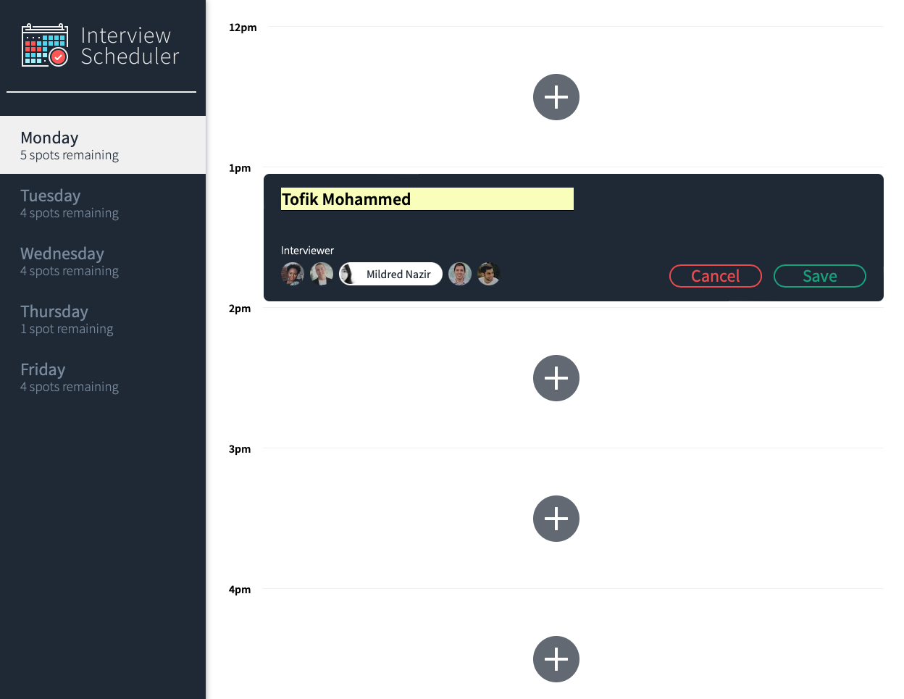
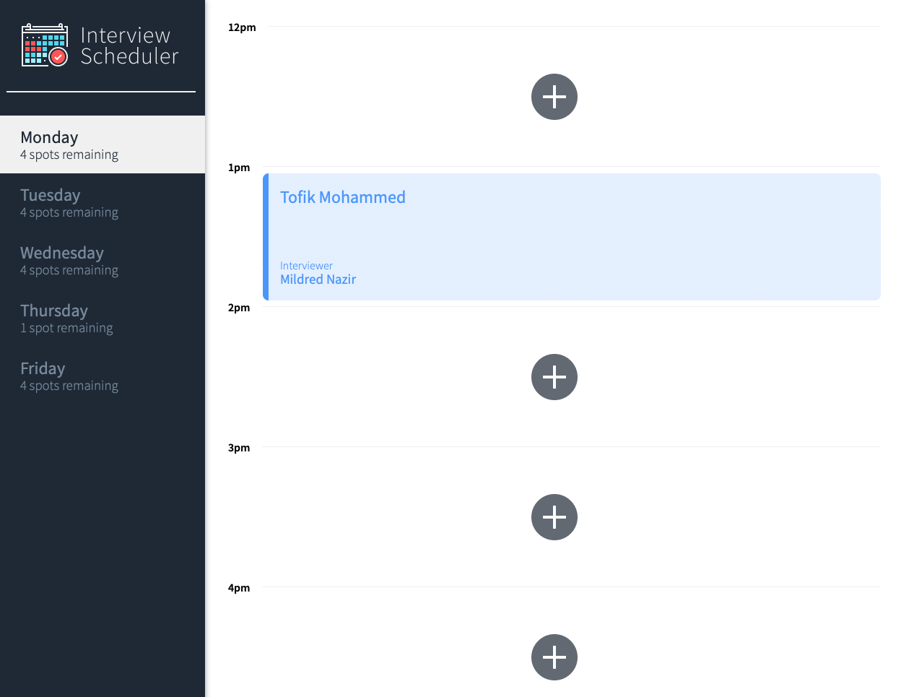

# Interview Scheduler

## Description

A student can use Interview Scheduler to add, update, and delete interview appointments. Create-react-app was used to build the project.

## Project Screenshots

  <p>
  
  
  </p>

## Key Features

- Create Interview
- Edit Interview
- Delete Interview
 
## Getting Started

### Install dependencies

```sh
npm install
```

### Running Webpack Development Server

```sh
npm start
```

### Running Jest Test Framework

```sh
npm test
```

### Running Storybook Visual Testbed

```sh
npm run storybook
```

#### Tests
- Jest
- Cypress

## Dependencies

- axios: ^0.25.0
- react: ^16.9.0
- cypress: ^9.3.1
- classnames: ^2.2.6
- react-dom: ^16.9.0
- normalize.css: ^8.0.1
- react-scripts: "3.0.0
