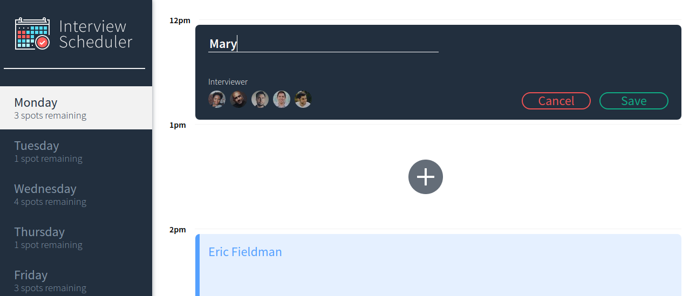

<h1 align="center">

</h1>
<h3 align="center">Booking an interview has never been easier</h3>
<p align="center">
  
  
  
</p>
<p align="center">
</p>

## Description

With Interview Scheduler, a student can create, edit and delete interview appointments. The project is built with create-react-app.

## Key Features

- Create Interview
- Edit Interview
- Delete Interview

#### Tests

- Unit and integration tests with Jest
- End-to-end tests with Cypres

## Project Screenshots

 <p align="center">
  
  
  </p>
 
## Getting Started

### Install dependencies

```sh
npm install
```

### Running Webpack Development Server

```sh
npm start
```

### Running Jest Test Framework

```sh
npm test
```

### Running Storybook Visual Testbed

```sh
npm run storybook
```

## Dependencies

- axios: ^0.25.0
- classnames: ^2.2.6
- cypress: ^9.3.1
- normalize.css: ^8.0.1
- react: ^16.9.0
- react-dom: ^16.9.0
- react-scripts: "3.0.0
